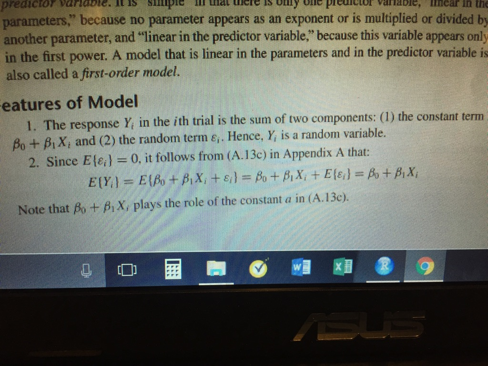
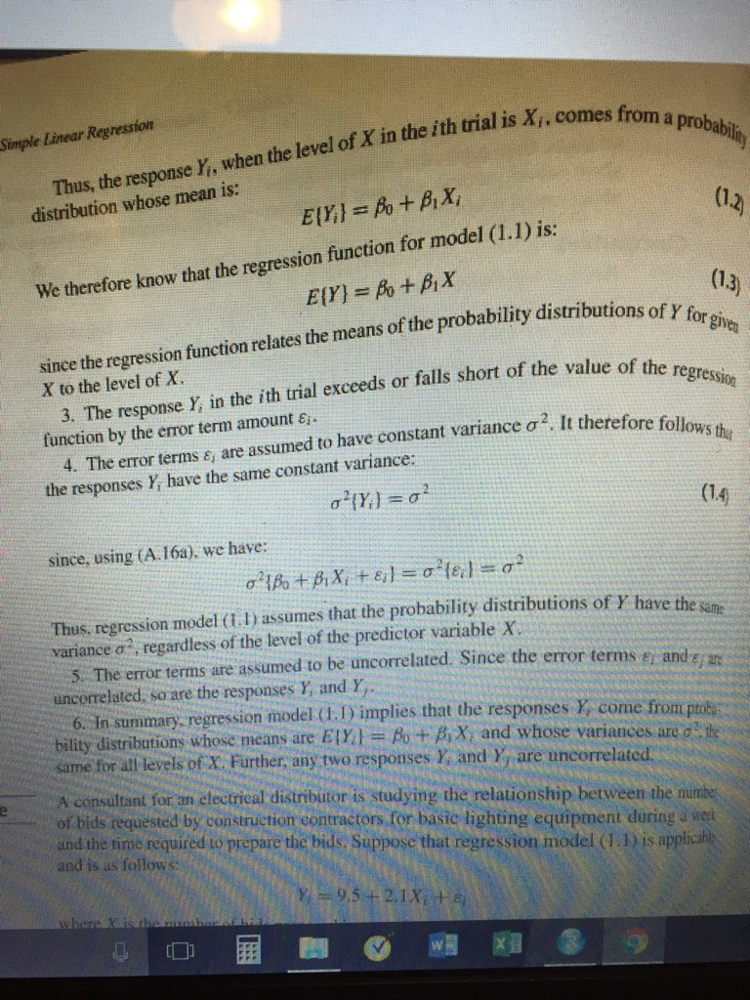
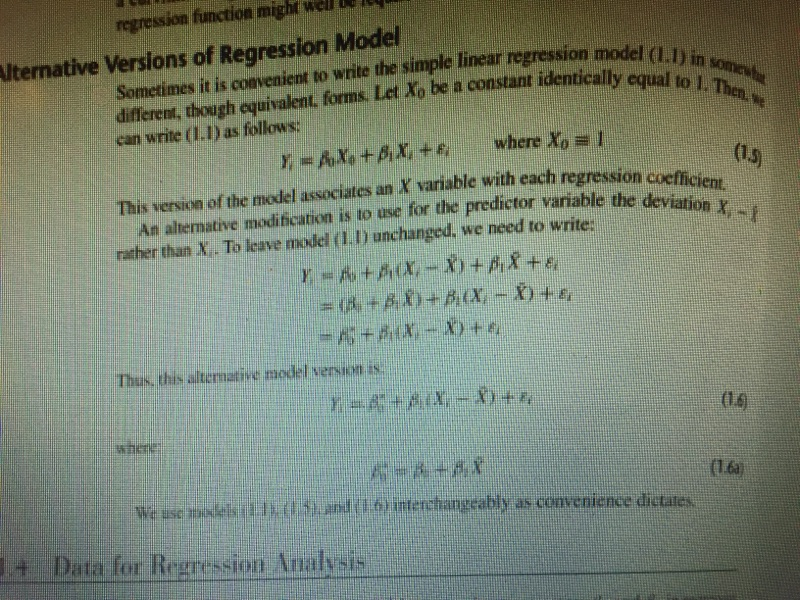
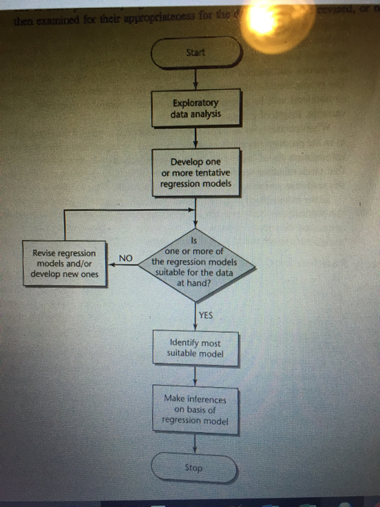
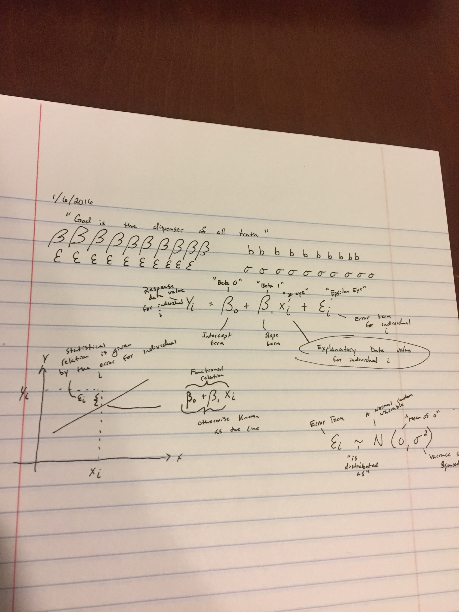

```{r, include=FALSE}
library(mosaic)
library(pander)
```

<script type="text/javascript">
 function showhide(id) {
    var e = document.getElementById(id);
    e.style.display = (e.style.display == 'block') ? 'none' : 'block';
 }
</script>


###Reading Points
####1.1 {3} Relations Between Variables

Functional Relation - Y=2X

Statistical Relation - Not a perfect relationship

####1.2 {3} Regression Models and Their Uses

Historical Origins - Sir Francis Galton 19th century - Regression is describing statistical relations between                       variables

Basic Concepts - regression is a formal way of expressing two essential ingredients of a statistical relation - 1 - Tendency of response variable Y to vary with the predictor variable X in a systematic fashion - 2 - scattering of points around the curve of statistical relationship - two postulations - 1 - there is a probability distribution of Y for each X - 2 - the mean of these probablity distributions vary in some systematic way with X (regression function of Y on X) - graph of the function is a regression curve 

Construction of Regression Models - SELECTION OF PREDICTOR VARIABLES - after one variable is chosen, what can explain the residuals, residual plot - the importance of the variable and the manipulation of said variable

Functional Form of Regression Relation - it is not just a line but fitting the systematic relation to formulas/functions - Scope of Model - putting a range to the observations 

Use of Regression Analysis - 1<description 2<control 3<prediction - can be used together  

Regression and Causallity - no causallity 

####1.3 {3} Simple Linear Regression Model With Distribution of Error Terms Unspecified

Formal Statement of Model - See picture below - simple linear model/first-order model

Important Features of Model -  

Meaning of Regression Parameters - beta 0 and beta 1 are regression coefficients

Alternative Versions of Regression Model - 

####1.4 {2} Data for Regression Analysis

Observable Data - nonexperimental studies - noncausal/too many variables

Experimental Data - treatment is the X - observants are the experimental units 

Completely Randomized Design - randomized assignment of treatment to experimental units

####1.5 {2} Overview of Steps in Regression Analysis



###Theory Points
####Chalkboard Recreated {3}


###Application Points
####Problem 1.19 {4}

```{r}
CH01PR19 <- read.table('http://www.stat.ufl.edu/~rrandles/sta4210/Rclassnotes/data/textdatasets/KutnerData/Chapter%20%201%20Data%20Sets/CH01PR19.txt', header=FALSE)
```

##### <a href="javascript:showhide('The Data 1')">The Data 19</a>

<div id="The Data 1" style="display:none;">

```{r}
pander(CH01PR19)
```

</div>

a)

```{r}
PR.lm <- lm(V1 ~ V2, data=CH01PR19)
pander(summary(PR.lm))
```

Beta 0 = 2.11405  Beta 1 = 0.03883  Y=2.11405+0.03883X

b) 

```{r}
plot(V1 ~ V2, data=CH01PR19)
abline(PR.lm)
```

The line fits the data. Although there is a lot of variance from the line, but both beta's are significant. 

c) 0.03883*30........1.1649+2.11405........3.27895 GPA = answer

d) No change because all points shift.

####Problem 1.20 {4}

```{r}
CH01PR20 <- read.table('http://www.stat.ufl.edu/~rrandles/sta4210/Rclassnotes/data/textdatasets/KutnerData/Chapter%20%201%20Data%20Sets/CH01PR20.txt', header=FALSE)
```

##### <a href="javascript:showhide('The Data 2')">The Data 20</a>

<div id="The Data 2" style="display:none;">

```{r}
pander(CH01PR20)
```

</div>

a)

```{r}
P.lm <- lm(V1 ~ V2, data=CH01PR20)
pander(summary(P.lm))
```

Beta 0 = -0.5802 Beta 1 = 15.04 Y=-0.5802+15.04X

b)

```{r}
plot(V1 ~ V2, data=CH01PR20)
abline(P.lm)
```

This looks like a much better fit than the previou problem. Beta0 is not significant, but for this situation, it does not really matter.

c) Beta0 is not significant in this situation. X is the number of services, while Y is the amount of time it takes to do. If there are 0 services, then we can expect no time to be spent. 

d) 15.04*5.....75.2-0.5802..... 74.6198 minutes = answer


